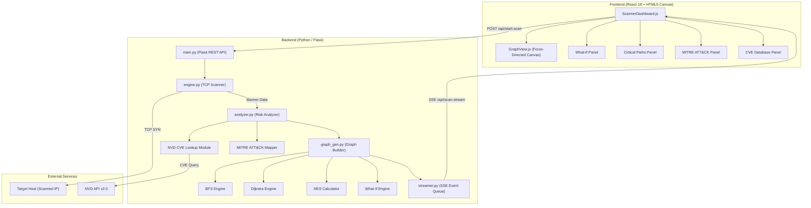
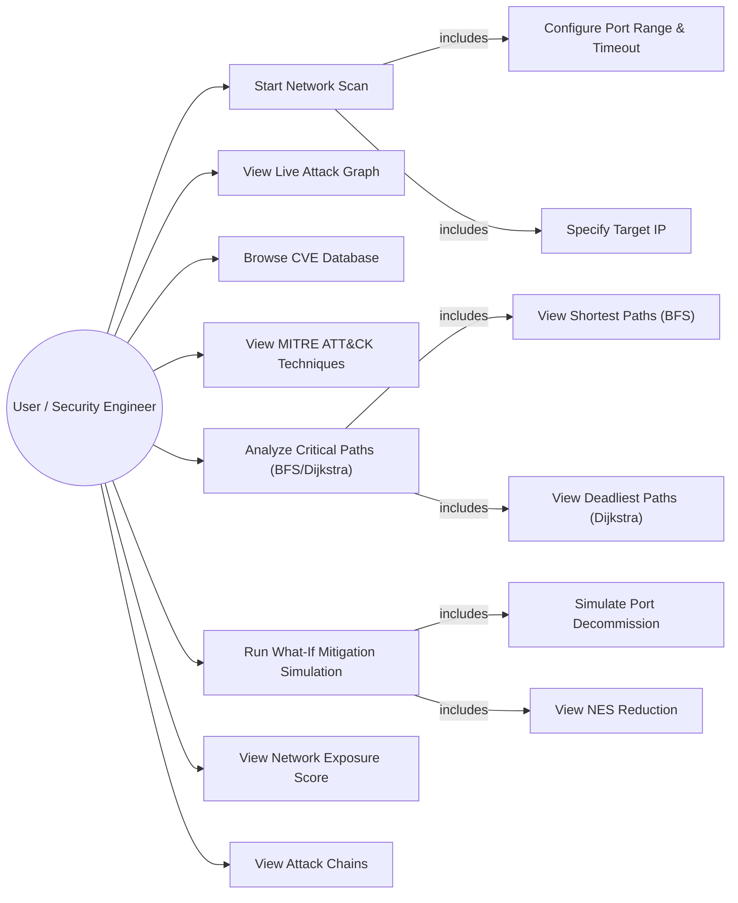
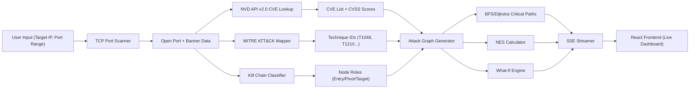
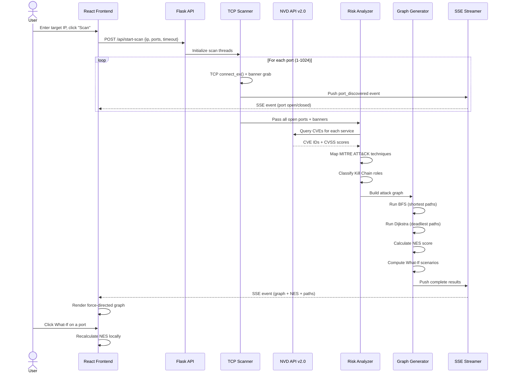
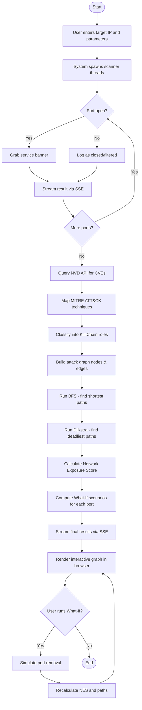
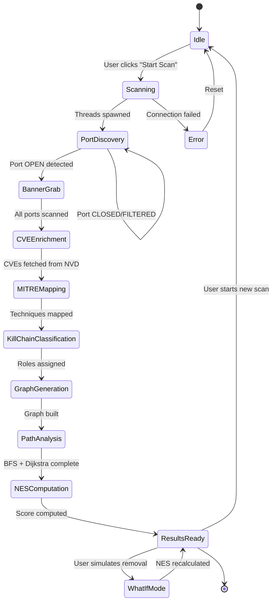

# Software Requirements Specification

## NET_SCAN — Network Service Discovery and Security Assessment Tool with Automated Reporting & Real-Time Attack Path Visualization

---

| Field | Details |
|---|---|
| **Document Version** | 2.0 (Final) |
| **Date** | May 2026 |
| **Status** | Final Submission |

### Prepared by

| Name | Specialization | SAP ID |
|---|---|---|
| Mridul Singh Rawat | CSF | 500119881 |
| Shiva Jakhad | CSF | 500119742 |
| Akshat Joshi | CSF | 500125233 |

### Revision History

| Version | Date | Description |
|---|---|---|
| 1.0 | Jan 2026 | Initial SRS — basic port scanning and graph rendering |
| 2.0 | May 2026 | Final SRS — added NVD/CVE integration, MITRE ATT&CK mapping, BFS/Dijkstra Critical Paths Engine, What-If Mitigation Engine, NES formula, 8-network validation |

---

## Table of Contents

1. Introduction
   - 1.1 Background & Problem Statement
   - 1.2 Purpose of the Project
   - 1.3 Target Beneficiaries
   - 1.4 Project Scope
2. Project Description
   - 2.1 System Overview
   - 2.2 Reference Algorithms
   - 2.3 Data and Data Structures
   - 2.4 SWOT Analysis
   - 2.5 Project Features
3. Design Diagrams
   - 3.1 Architecture Diagram
   - 3.2 Use Case Diagram
   - 3.3 Class Diagram
   - 3.4 Data Flow Diagram
   - 3.5 Sequence Diagram
   - 3.6 Activity Diagram
   - 3.7 State Diagram
4. System Requirements
   - 4.1 User Interface
   - 4.2 Software Interface
   - 4.3 Hardware Requirements
   - 4.4 Protocols
5. Non-Functional Requirements
6. Other Requirements

---

## 1. INTRODUCTION

### 1.1 Background & Problem Statement

**Background:** In modern network environments, organizations often lack visibility into what attackers can see on their own networks. Traditional scanning tools like Nmap and Nessus are highly technical, command-line oriented, and produce static outputs that are difficult to interpret immediately.

**Problem Statement:** Security teams face critical blind spots regarding exposed ports and lack the risk context to understand why those ports are dangerous. Furthermore, existing tools rarely model how an attacker would chain vulnerabilities together to move laterally through internal services. Just finding a single weak machine is not enough — defenders need to understand the exact attack paths, their severity, and which remediation action yields the highest risk reduction.

**Proposed Solution:** NET_SCAN is a full-stack, real-time network intelligence platform. It scans target hosts, queries the National Vulnerability Database (NVD) for live CVE data, classifies services into Cyber Kill Chain roles, maps vulnerabilities to MITRE ATT&CK techniques, computes both shortest and deadliest attack paths using BFS and Dijkstra algorithms, and streams all results live to a browser-based force-directed attack graph. A What-If Mitigation Engine allows defenders to simulate port decommissioning and instantly see the resulting NES reduction.

### 1.2 Purpose of the Project

| Purpose | Description |
|---|---|
| **Primary** | To develop a proactive network intelligence engine that automatically classifies service risk, models lateral movement kill chains, identifies critical attack paths via dual-algorithm analysis (BFS + Dijkstra), enriches findings with real-time CVE/NVD data and MITRE ATT&CK techniques, and streams results live to the browser. |
| **Secondary** | To calculate a single composite Network Exposure Score (NES, 0–100) and provide a What-If simulation engine so defenders can quantify the impact of specific remediation actions before implementing them. |

### 1.3 Target Beneficiaries

| Beneficiary | Use Case |
|---|---|
| Network/Security Engineers | Performing internal audits, visualizing lateral movement paths, prioritizing remediation via What-If analysis |
| Students & CTF Players | Learning ethical hacking, penetration testing, understanding network topology and kill chains |
| Developers | Verifying local service exposure quickly without needing command-line expertise |
| Security Operations Teams | Using NES scores to track structural risk over time and integrating with SIEM/SOAR workflows |

### 1.4 Project Scope

| Scope | Description |
|---|---|
| **Functional Scope** | Multi-threaded TCP port scanning (1–1024), service banner grabbing, NVD API v2.0 CVE enrichment, MITRE ATT&CK technique mapping, Cyber Kill Chain classification (Entry → Pivot → Target), BFS shortest-path and Dijkstra deadliest-path computation, NES calculation, What-If mitigation simulation, live SSE streaming, force-directed graph rendering |
| **Out of Scope** | Active vulnerability exploitation (Metasploit-style), internet-wide scanning (Shodan-style), OS fingerprinting, IPv6 scanning |
| **Deliverables** | Python/Flask backend engine, React-based live dashboard, real-time SSE streamer, CVE/MITRE intelligence modules, What-If analysis engine, custom Canvas graph renderer |

---

## 2. PROJECT DESCRIPTION

### 2.1 System Overview

NET_SCAN is a fully integrated full-stack tool consisting of a Python backend intelligence pipeline and a React frontend. The pipeline executes sequentially: **Scan → CVE Enrichment → MITRE Mapping → Kill Chain Classification → Attack Graph Generation → Critical Path Analysis → NES Computation → Live Streaming**.

| Component | Technology | Role |
|---|---|---|
| Port Scanner | Python (socket, threading) | Multi-threaded TCP scanning with banner grabbing |
| CVE Enrichment | NVD API v2.0 | Real-time vulnerability lookup by service/version |
| MITRE Mapper | Custom rule engine | Maps services to ATT&CK techniques (T1048, T1210, etc.) |
| Kill Chain Classifier | Heuristic engine | Assigns Entry/Pivot/Target roles to services |
| Critical Paths Engine | BFS + Dijkstra | Finds shortest and deadliest attack paths simultaneously |
| NES Calculator | Mathematical formula | Computes network risk score (0–100) |
| What-If Engine | Graph re-computation | Simulates port removal and recalculates NES in real-time |
| API Server | Flask + flask-cors | REST API and SSE streaming endpoints |
| Frontend | React 18 + HTML5 Canvas | Live dashboard, interactive force-directed graph |

### 2.2 Reference Algorithms

| Algorithm | Type | Description |
|---|---|---|
| **Multi-threaded TCP Socket Scanning** | Discovery | Producer-consumer thread model. Workers open raw TCP sockets via `connect_ex()` to determine OPEN/FILTERED/CLOSED status. Open ports trigger a secondary `recv()` probe to grab service banners. |
| **BFS (Breadth-First Search)** | Shortest Path | Finds the quickest route from Entry nodes to Target nodes, counting the fewest number of network hops. Labels results as SHORTEST. |
| **Dijkstra's Algorithm** | Deadliest Path | Uses CVSS severity scores as edge weights (inverted so higher severity = lower cost). Finds the path traversing the most critical vulnerabilities. Labels results as DEADLIEST. |
| **Force-Directed Graph** | Visualization | Custom physics simulation: nodes repel (Coulomb's law), edges attract (Hooke's law), gravity centers the layout. Damping settles the graph when velocities drop below 0.5px/frame. |
| **NES Computation** | Risk Scoring | Formula: `S_exp = Σ(w_cve × D_node) × α^P` where `w_cve` = CVE severity, `D` = depth, `P` = lateral path count, `α` = blast radius multiplier. Scaled 0–100. |

### 2.3 Data and Data Structures

| Aspect | Description |
|---|---|
| **Data Collected** | Port numbers, service banners, service classifications, CVE IDs, CVSS 3.1 scores, MITRE ATT&CK technique IDs, attack chain edges, NES components |
| **Data Structures** | Python `Queue` for thread-safe port distribution; `dict` for SSE stream management per target IP; `ScanContext` objects for isolated scan state; JSON graph nodes/edges for frontend rendering |
| **External Data Sources** | NVD API v2.0 (real-time CVE queries), MITRE ATT&CK framework (technique classification) |
| **Storage Format** | Complete JSON serialization to `scan_output.json` upon scan completion |

### 2.4 SWOT Analysis

| Category | Details |
|---|---|
| **Strengths** | Real-time live streaming via SSE; dual-algorithm critical path engine (BFS + Dijkstra); live NVD CVE enrichment; MITRE ATT&CK technique mapping; What-If mitigation simulation; zero false-positive guarantee on clean networks; interactive force-directed graph; single composite NES metric |
| **Weaknesses** | Raw scanning speed does not match C-based tools like Masscan; currently scans single IP targets (not full subnets); NVD API rate limits can delay CVE enrichment; banner-based fingerprinting may return legacy CVEs |
| **Opportunities** | Expansion into subnet/CIDR scanning across multiple machines; machine learning for attack path prediction; SOAR/SIEM integration for automated remediation; cloud deployment via Docker/Kubernetes; PDF report generation |
| **Threats** | Aggressive firewalls filtering packets (handled via configurable timeouts); NVD API deprecation or rate limit changes; evolving MITRE ATT&CK framework requiring rule updates |

### 2.5 Project Features

| Feature | Description |
|---|---|
| **Real-Time Streaming** | Results stream port-by-port to the React UI via SSE — no waiting for scan completion |
| **Kill Chain Modeling** | Translates raw port data into attack narratives with Entry → Pivot → Target classification |
| **NVD CVE Enrichment** | Queries NVD API v2.0 in real-time to fetch CVE IDs and CVSS 3.1 severity scores for each discovered service |
| **MITRE ATT&CK Mapping** | Maps services to specific techniques (T1048 Exfiltration Over Alt Protocol, T1210 Exploitation of Remote Services, T1021.004 SSH, T1505.003 Web Shell, T1572 Protocol Tunneling, T1136 Create Account) |
| **Critical Paths Engine** | Runs BFS and Dijkstra simultaneously to find both shortest-hop and highest-risk attack paths |
| **Network Exposure Score** | Mathematical formula producing a 0–100 risk score with four tiers: Low (0–30), Medium (31–59), High (60–80), Critical (81+) |
| **What-If Mitigation** | Click any service to simulate decommissioning it; NES and attack chains recalculate instantly showing point reduction |
| **Interactive Attack Graph** | Browser-based force-directed graph with color-coded nodes (by risk/role), animated edges, hover details |

---

## 3. DESIGN DIAGRAMS

### 3.1 Architecture Diagram

### 3.2 Use Case Diagram

### 3.3 Class Diagram

```mermaid
classDiagram
    class ScanEngine {
        -target_ip: str
        -port_range: tuple
        -timeout_ms: int
        -threads: int
        -port_queue: Queue
        +start_scan()
        +scan_port(port: int): PortResult
        +grab_banner(sock: socket): str
    }

    class RiskAnalyzer {
        -cve_cache: dict
        +classify_service(port, banner): ServiceRole
        +fetch_cves(service: str): list[CVE]
        +map_mitre_technique(service): list[Technique]
        +calculate_risk_level(): RiskLevel
    }

    class GraphGenerator {
        -nodes: list[Node]
        -edges: list[Edge]
        +build_kill_chain(): Graph
        +add_entry_node(port, service)
        +add_pivot_node(port, service)
        +add_target_node(port, service)
        +generate_edges(): list[Edge]
    }

    class CriticalPathsEngine {
        -graph: Graph
        +run_bfs(source, target): Path
        +run_dijkstra(source, target): Path
        +get_shortest_paths(): list[Path]
        +get_deadliest_paths(): list[Path]
    }

    class NESCalculator {
        -alpha: float
        +compute_score(graph): float
        +get_tier(score): str
    }

    class WhatIfEngine {
        -original_graph: Graph
        +simulate_removal(port): WhatIfResult
        +compute_nes_delta(): float
        +rank_remediation_targets(): list
    }

    class SSEStreamer {
        -event_queues: dict
        +push_event(target_ip, event)
        +stream(target_ip): Generator
    }

    class FlaskAPI {
        +start_scan(request): Response
        +scan_stream(target_ip): SSEResponse
        +get_results(target_ip): JSON
    }

    ScanEngine --> RiskAnalyzer : feeds port data
    RiskAnalyzer --> GraphGenerator : feeds classified services
    GraphGenerator --> CriticalPathsEngine : provides graph
    GraphGenerator --> NESCalculator : provides graph
    GraphGenerator --> WhatIfEngine : provides graph
    FlaskAPI --> ScanEngine : triggers scan
    FlaskAPI --> SSEStreamer : streams events
    SSEStreamer --> FlaskAPI : SSE connection
```

### 3.4 Data Flow Diagram

### 3.5 Sequence Diagram

### 3.6 Activity Diagram

### 3.7 State Diagram

---

## 4. SYSTEM REQUIREMENTS

### 4.1 User Interface

| Requirement | Specification |
|---|---|
| Framework | React 18.2.0 |
| Styling | TailwindCSS + custom CSS |
| Graph Rendering | Native HTML5 Canvas with custom force-directed physics engine |
| Tabs | Dashboard, Attack Graph, Scan Results, Attack Chains, Critical Paths, MITRE ATT&CK, CVE Database, What-If Analysis |
| Responsiveness | Must render correctly on screens ≥1024px width |

### 4.2 Software Interface

| Component | Technology | Version |
|---|---|---|
| Backend Language | Python | 3.x |
| Web Framework | Flask + flask-cors | Latest |
| Frontend Framework | React | 18.2.0 |
| CVE Data Source | NVD API | v2.0 |
| Graph Physics | Custom HTML5 Canvas | N/A |
| Package Manager | npm (frontend), pip (backend) | Latest |

### 4.3 Hardware Requirements

| Requirement | Specification |
|---|---|
| Processor | Any modern CPU capable of running Python 3.x |
| RAM | Minimum 4 GB |
| Network | Active network interface (Ethernet or Wi-Fi) with access to target hosts |
| Storage | Minimum 500 MB for application and scan output storage |

### 4.4 Protocols

| Protocol | Usage |
|---|---|
| TCP | Network probing via raw socket connections (ports 1–1024) |
| HTTP | REST API control (`POST /api/start-scan`, `GET /api/results`) |
| SSE (Server-Sent Events) | Unidirectional live streaming (`GET /api/scan-stream`) |
| HTTPS | NVD API v2.0 queries for CVE data |

---

## 5. NON-FUNCTIONAL REQUIREMENTS

| Requirement | Specification |
|---|---|
| **Performance** | Must support dynamic queue draining and thread cancellation without crashing if a user starts a concurrent scan. Graph visualization must auto-settle when node velocities drop below 0.5px/frame. NES and What-If recalculation must complete within 500ms. |
| **Reliability** | Zero false positives on clean networks (validated: Networks A and D returned NES = 0). NVD API failures must be handled gracefully with cached fallback data. |
| **Resilience** | Frontend implements exponential backoff retries (2s → 4s → 8s → 15s) and falls back to standard polling if the SSE connection drops. |
| **Scalability** | Architecture supports future expansion to subnet scanning (CIDR ranges) and cloud deployment (Docker/Kubernetes). |
| **Maintainability** | Strict separation of concerns: `engine.py` (scanning), `streamer.py` (SSE), `analyzer.py` (risk + CVE + MITRE logic), `graph_gen.py` (graph structures + BFS/Dijkstra + NES + What-If). |
| **Security** | Ethical scanning only (TCP SYN to ports 1–1024, no exploitation). Configurable timeout to respect target network policies. |

---

## 6. OTHER REQUIREMENTS

| Requirement | Description |
|---|---|
| **Extensibility** | Designed to support plugin systems for custom vulnerability scripts, SOAR/SIEM integration, and PDF report generation |
| **Portability** | Runs on Windows, macOS, and Linux with Python 3.x and Node.js installed |
| **Documentation** | Inline code comments, API endpoint documentation, and user guide for the dashboard |
| **Ethical Compliance** | All public IP scanning limited to passive TCP SYN probes; no active exploitation or payload delivery |
