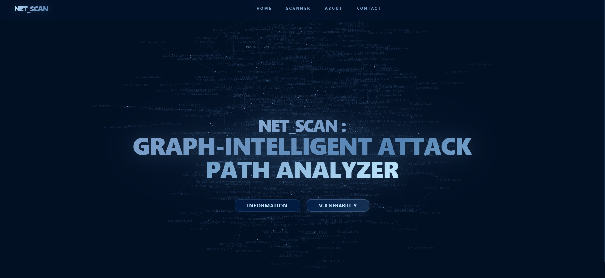
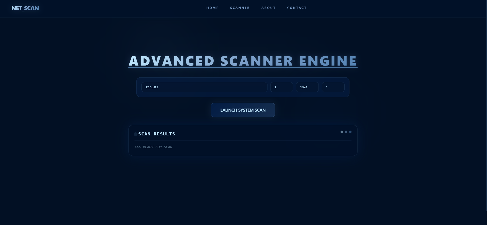

# NET_SCAN: Automated Lateral Movement Detection & Cyber Kill Chain Modeling


**NET_SCAN** is a real-time network intelligence platform that goes beyond traditional port scanning tools like Nmap or Nessus. It automatically graphs distributed attack paths, showing how adversaries can chain vulnerabilities together across network infrastructures using **Cyber Kill Chain Modeling** and **MITRE ATT&CK Mapping**.

---

## Core Novelty

Network security scans usually produce long text reports listing isolated vulnerabilities. NET_SCAN turns that data into interactive, force-directed attack graphs. It automatically classifies services into kill-chain roles (**Entry**, **Pivot**, and **Target** nodes), traces lateral movement paths using BFS and Dijkstra algorithms, and computes a mathematically justified **Network Exposure Score (NES)** on a 0–100 scale.

## Key Features

- **Heuristic Kill Chain Classification:** Automatically sorts discovered services into Entry, Pivot, and Target roles based on how attackers typically exploit them.
- **Automated Lateral Movement Maps:** Traces attack linkages such as `Entry → Pivot → Target` using MITRE ATT&CK techniques (T1048, T1210, T1572, T1021, T1505).
- **Dual-Algorithm Critical Paths Engine:** Runs both **BFS (Shortest Path)** and **Dijkstra (Deadliest Path)** simultaneously, revealing both the quickest and most dangerous routes to target nodes.
- **Network Exposure Score (NES):** Scores network risk from 0 to 100 using CVSS v3.1 severity weights combined with lateral path compounding logic. Four risk tiers: Low (0–30), Medium (31–59), High (60–80), Critical (81+).
- **Real-Time Canvas Visualization:** Interactive, physics-based attack graphs streamed live via Server-Sent Events (SSE) with a glassmorphism-themed UI.
- **Attack Simulation Controls:** Step-through attack path replay with Start, Pause, Resume, Reset, and Step-Forward controls.
- **NVD CVE Enrichment:** Real-time lookup of discovered service banners against the National Vulnerability Database API.
- **"What-If" Mitigation Engine:** Simulate removing a vulnerable service and instantly see the NES impact — letting you prioritize which fixes matter most.
- **Scoring Criteria Panel:** Transparent breakdown of exposure factors including CVE severity, lateral path count, blast radius coverage, and network topology depth.
- **Contact Page:** Dedicated team contact page with GitHub and email links for project maintainers.

---

## Screenshots

### Home Page - Graph-Intelligent Attack Path Analyzer

The landing page features the main title with "GRAPH-INTELLIGENT ATTACK PATH ANALYZER", dynamic IP graph background, and quick access buttons to Information and Vulnerability scanning modules.

### Advanced Scanner Engine

The scanner dashboard allows users to enter target IP addresses (with port range configuration), and launch system scans with the "LAUNCH SYSTEM SCAN" button. Real-time progress updates display in the SCAN RESULTS section.

---

## Project Structure

```text
NET_SCAN/
├── backend/
│   ├── app/
│   │   ├── main.py          # Core Flask API & SSE Streamer
│   │   ├── mapping/         # Kill Chain Analytics & Vulnerability Intelligence
│   │   │   ├── analyzer.py  # Pathfinding, MITRE mappings, Attack chains
│   │   │   ├── graph_gen.py # Force-directed simulation logic
│   │   │   └── cve_lookup.py# NVD integration wrapper
│   │   ├── reporting/       # Professional PDF Export Engine
│   │   └── scanner/         # Multi-threaded TCP Port Enumeration Engine
│   │       ├── engine.py    # Multi-threaded worker queues
│   │       └── banner.py    # Service heuristic inferences
├── frontend/
│   ├── public/
│   │   └── index.html       # HTML shell (loads Google GIS script)
│   ├── src/
│   │   ├── components/      # React UI
│   │   │   ├── Graphview.js        # HTML5 Canvas Graph
│   │   │   ├── ScannerDashboard.js # Primary Interaction Context
│   │   │   ├── Hero.js             # Landing Page
│   │   │   ├── About.js            # Project Information
│   │   │   ├── Contact.js          # Team Contact Page
│   │   │   └── GraphBackground.js  # Dynamic IP Graph Background
│   │   └── services/        # Subroutines & API configs
│   └── package.json         # Node Dependency manifest
├── validation/              # Headless validation pipeline
└── README.md
```

## Installation & Setup

NET_SCAN uses a decoupled architecture with a Python backend and a React frontend communicating via REST APIs and Server-Sent Events.

### 1. Backend (Scanner & Intelligence Pipeline)
```bash
cd backend
python -m venv venv

# Activate Environment (Windows)
venv\Scripts\activate
# Activate Environment (Mac/Linux)
# source venv/bin/activate

pip install -r requirements.txt
```

### 2. Frontend (Dashboard UI)
```bash
cd frontend
npm install
```


## Usage

1. **Start the Flask API:**
   ```bash
   cd backend
   python run.py  # OR python app/main.py
   ```
   *Backend runs at `http://127.0.0.1:5000`.*

2. **Start the React Visualizer:**
   ```bash
   cd frontend
   npm start
   ```
   *Dashboard opens at `http://localhost:3000`.*

3. Enter your **Target IP Address**, configure scan settings, and click **LAUNCH SYSTEM SCAN**. The attack graph builds in real-time as the scan progresses.

---

## Validation Pipeline

NET_SCAN includes a headless validation script to run the scanning engine against predefined targets without the UI:

```bash
cd backend
python ../validation/scripts/run_full_pipeline.py
```

Results are saved to `validation/results/run_X/netscan/`.

---

## Contact

| Maintainer | GitHub | Email |
|------------|--------|-------|
| Mridul Singh Rawat | [@MRIDULsinghRAWAT](https://github.com/MRIDULsinghRAWAT) | mridulsinghrawat31@gmail.com |
| Akshat Joshi | [@Akshat-Joshi0](https://github.com/Akshat-Joshi0) | akshatjoshi7218@gmail.com |

---

## License

This project is licensed under the MIT License — see the [LICENSE](LICENSE) file for details.
